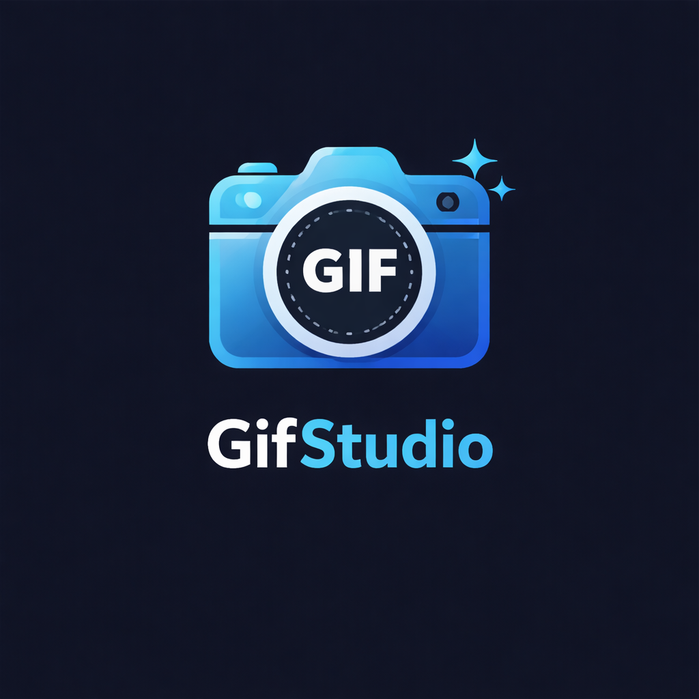

<!-- codex-branding:start -->

  
  
  

<!-- codex-branding:end -->

# GifStudio

Browser-based GIF creation and editing studio. Create, edit, and export GIFs with frame manipulation, effects, and timing controls — 100% client-side, single HTML file.

## Features

- **GIF Creation** — Build GIFs from images or video frames
- **Frame Editor** — Add, remove, reorder, and duplicate frames
- **Timing Control** — Set per-frame delay and playback speed
- **Effects** — Apply filters, resize, crop, and transform frames
- **Live Preview** — Real-time GIF preview as you edit
- **Export** — Download finished GIFs at configurable quality
- **Dark Theme** — Professional dark-themed interface
- **Zero Install** — Single HTML file, runs entirely in the browser

## Usage

1. Download or clone the repository
2. Open `index.html` in any modern browser
3. Start creating GIFs

## License

MIT License
